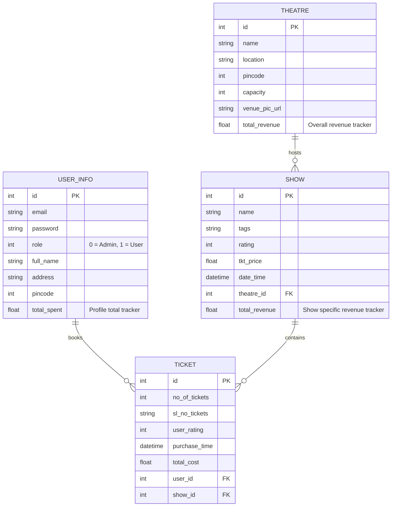

# CineVerse - Theatre & Movie Ticket Booking System 🎭🎟️

CineVerse (My Ticket Show) is a modern, responsive, and feature-rich ticket booking web application built using **Flask** and **SQLite**. It offers a dual-dashboard interface: a powerful control panel for **Administrators** to manage venues/shows and track financial reports, and an intuitive client portal for **Users** to search, book tickets, view transaction histories, and analyze their spending patterns.

---

## 🚀 Tech Stack

The application leverages a robust set of libraries and tools:

### Backend
*   **Python 3** - The core programming language.
*   **Flask (v3.0.3)** - Micro-framework handling web routing, authentication, and layouts.
*   **SQLAlchemy (v2.0.27)** & **Flask-SQLAlchemy (v3.1.1)** - Object-Relational Mapper (ORM) for schema definition, relationships, and queries.
*   **Flask-RESTful (v0.3.10)** - Installed for structured API development capabilities.
*   **Werkzeug (v3.0.1)** - Providing secure file utilities (e.g., `secure_filename`) for profile and venue picture uploads.

### Frontend
*   **Jinja2** - Dynamic HTML templating engine.
*   **Bootstrap 4** - Styling framework for building clean, responsive layouts.
*   **Bootstrap Icons** - Modern, lightweight typography-friendly icons.
*   **Chart.js** - Client-side library used to render dynamic visual reports and dashboards.
*   **Vanilla CSS** - Custom stylings (`main.css`) including dark-mode glassmorphism, animated glow effects, hovering card animations, and responsive buttons.

### Database
*   **SQLite** - Lightweight relational database stored locally (`instance/ticket_show.sqlite3`).

### Production Server
*   **Gunicorn (v23.0.0)** - High-performance WSGI HTTP server ready for production deployment.

---

## 📊 Database Architecture

The database schema resides in [backend/models.py](file:///c:/Users/porwa/OneDrive/Documents/My_Ticket_show/My_Ticket_show/backend/models.py) and is composed of four primary entities:



---

## 🌟 Key Features

### 🔐 Authentication & Security
*   **Role-Based Access Control (RBAC):** Restricts dashboards based on user type (`0` for Admin, `1` for standard users).
*   **Registration Validation:** Checks if the email is already in use and ensures all profile details (Address, Name, Pincode) are correctly populated.

### 👑 Administrator Dashboard (`/admin/<name>`)
*   **Venue/Theatre Management:** Admins can add, edit, and delete theatres. Includes an upload system that saves theater images locally (`./uploaded_files/`).
*   **Show Management:** Admins can schedule shows for specific venues, customize tags, set ticket pricing, and configure show dates/times.
*   **User Details & Leaderboard:** A specialized view displaying all registered users ranked by their total amount spent (`total_spent` desc).
*   **Admin Summary & Visual Reports:** Features dynamic Chart.js representations:
    *   **Theatre Capacities:** A colorful bar chart comparing size across all venues.
    *   **Revenue by Theatre:** A doughnut chart visualizing proportional earnings.

### 👤 User Dashboard (`/user/<id>/<name>`)
*   **Intuitive Discovery:** Search bar allowing clients to search for venues, locations, or specific show names.
*   **Seat Booking & Financial Computations:** Real-time seat allocation verification checking against the venue's overall capacity. Upon booking, ticket cost is calculated, and total metrics (`total_spent` for the User, `total_revenue` for the Show and Theatre) update atomically inside a database session.
*   **Booking History:** Access a clean list of past and upcoming booked tickets, complete with show details and booking times.
*   **Personal Spending Summary:** Custom Chart.js panels:
    *   **Spending by City:** Doughnut chart detailing expenditures across locations.
    *   **Spending by Theatre:** Bar chart tracking which theaters get the most booking traction.
    *   **Cumulative Statistics:** Clearly displays the overall lifetime expenditure (`₹total_spent`).

---

## 📂 Project Structure

```text
My_Ticket_show/
│
├── app.py                     # Entry point of the Flask application
├── requirements.txt           # Project dependencies and package versions
│
├── backend/
│   ├── controllers.py         # Application routers, controllers, and helpers
│   └── models.py              # SQLAlchemy database schemas & relationships
│
├── instance/
│   └── ticket_show.sqlite3    # Local SQLite database file (generated automatically)
│
├── static/
│   ├── images/                # App logos and general assets
│   └── styles/
│       └── main.css           # Styling rules, animations, and dark-theme configurations
│
├── templates/                 # Jinja2 HTML layout components & views
│   ├── admin_layout.html      # Global layout template for admins
│   ├── user_layout.html       # Global layout template for clients
│   ├── index.html             # CineVerse welcome page
│   ├── login.html             # User/Admin login screen
│   ├── signup.html            # Registration form
│   ├── add_venue.html         # Admin venue creator
│   ├── add_show.html          # Admin show scheduler
│   ├── admin_dashboard.html   # Main dashboard for administrators
│   ├── admin_summary.html     # Charts and reports dashboard for admins
│   ├── user_details.html      # Admin portal listing registered users
│   ├── user_dashboard.html    # User main screen with show exploration
│   ├── book_ticket.html       # User seat selection page
│   ├── user_bookings.html     # Past & present bookings listing
│   └── user_summary.html      # Individual spending analytics
│
└── uploaded_files/            # Uploaded images directory for venues/theatres
```

---

## 🔧 Installation & How to Run

Follow these steps to set up and run CineVerse locally:

### 1. Clone the Repository
```bash
git clone https://github.com/eren-yeager08/My_Ticket_show.git
cd My_Ticket_show
```

### 2. Set Up a Virtual Environment
It is highly recommended to run this project inside a Python virtual environment:
```bash
# Create virtual environment
python -m venv venv

# Activate it (Windows)
.\venv\Scripts\activate

# Activate it (macOS/Linux)
source venv/bin/activate
```

### 3. Install Dependencies
```bash
pip install -r requirements.txt
```

### 4. Run the Application
Start the development server:
```bash
python app.py
```
By default, the server will start on `http://127.0.0.1:5000/`. Open this link in your browser to access the home page.

---

## 🎨 Theme & Styling details

CineVerse utilizes a curated premium dark-mode theme to provide a high-end, immersive cinema experience:
*   **Colors:** Deep oceanic blues (`#0f2027` to `#2c5364`), neon Cyan accents (`#00ffff`), and rich gradient buttons (`#00bcd4` to `#2196f3`).
*   **Visual Highlights:** Glassmorphic navigation bars, floating background glow animations (`floatGlow`), card hover scale effects, and custom rounded charts.